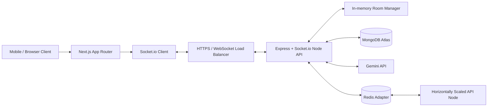

# DrawHunt Architecture

## System Diagram



## Data Flow

1. A player opens the Next.js app, enters a nickname, and creates or joins a room.
2. The Socket.io server validates an optional JWT or creates a guest user, then returns `{ room, player, token }`.
3. Room state is broadcast with `roomUpdated`; durable metadata is persisted to MongoDB.
4. Drawing uses normalized coordinates in `StrokePacket` objects. `drawMove` is sent with `socket.volatile.emit` so stale packets can be dropped under congestion.
5. The canvas renders incoming packets through `requestAnimationFrame`, preventing network bursts from blocking touch input.
6. Completed strokes are stored in room memory and the latest compressed snapshot is attached to the room for reconnect recovery.
7. Game mode events update timers, challenges, scores, chat, hunt taps, and match results.
8. Gemini challenge generation is served by the API with curated fallback prompts when no API key is configured.

## Event Contract

Room events: `createRoom`, `joinRoom`, `leaveRoom`, `startGame`, `endGame`, `kickPlayer`, `updateRoomSettings`.

Drawing events: `drawStart`, `drawMove`, `drawEnd`, `clearCanvas`, `undoStroke`, `redoStroke`.

Game events: `timerUpdate`, `scoreUpdate`, `challengeUpdate`, `playerReady`, `gameFinished`, `chatMessage`, `huntTap`.

## Folder Structure

```text
apps/
  api/
    src/
      config/       environment and Mongo connection
      middleware/   JWT, rate limits, security controls
      models/       User, Room, Match Mongoose schemas
      routes/       REST endpoints for auth, rooms, challenges
      services/     Gemini challenge service
      socket/       real-time room and drawing orchestration
  web/
    app/            Next.js App Router pages and global styles
    components/     lobby, toolbar, chat, canvas, game shell
    lib/            socket and canvas helpers
    store/          Zustand game state
packages/
  shared/
    src/            shared TypeScript contracts and constants
docs/               architecture, deployment, hardening
```

## Architecture Decisions

- Next.js and Socket.io are split into separate deployables so Vercel can host the frontend while Render/Railway/AWS runs long-lived WebSocket processes.
- Room state is in memory for low latency, with MongoDB used for users, room metadata, match results, and replay snapshots.
- Redis Adapter is optional locally and required for horizontal scaling because it broadcasts Socket.io events across API instances.
- Canvas packets use normalized coordinates instead of pixels, making strokes deterministic across phone, tablet, and desktop canvases.
- The first production optimization target is drawing smoothness: volatile move packets, batching, high-DPI setup, and animation-frame rendering.

